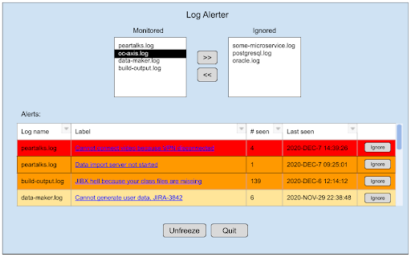

# Log Alerter

## Description:

A client-server application that allows a team of software developers to see notes from others about messages appearing in logs within their individual development environments.  Logs can be either files, or an application’s log output. There is also the capability to manually search for relevant alerts by copying and pasting text, perhaps from a file or even output displayed in an application or console window.

The server, backed by a relational database, will provide a web interface to:

*   View and add users
*   View and add logs
*   View, add, modify, and delete alerts on log messages
*   Search for alerts by pattern match on an input string

The client will provide a local GUI to monitor their local log files and view alerts related to specific log messages that have been detected via pattern match.

Every minute, the client will POST an update to the server, for how many times each alert had been triggered. The server response will contain an updated list of alerts, along with information about their occurrences on all clients.

Server will have a database with tables for:

*   users
*   logs
*   alerts
*   notes

Server will expose REST API with necessary CRUD functionality for this data.

## Quick Setup:
1. Install PostgreSQL 13. A default user with your system username and no password should be created.
2. Change to the "db" folder and type: `psql -U postgres -f schema.sql`
3. Install Maven on the command line and/or the maven plugin in your IDE.

Notes:
* To reset the database, change to the "db" folder and type: `psql -U postgres -f schema.sql logalerter`
* To use the test data, change to the "db" folder and type: `psql -U postgres -f test_data.sql logalerter`

## Server App:

### User Registration:

Webapp registration page lets you add your unique email address, name, contact info. Has submit and cancel button.

View list of users shows all registered users, each a link to a user page.

When you click to go to user page, you see their email address, name, contact info, and list of labels being links to alerts they’ve added notes for (including the ones they’ve created), sorted alphabetically.

### View Alert:

A window with a weblink to label, regex, number of client hits, last client hit, number of search hits, last search hit, and a list of notes, each marked with an email address linking to a user page, a modify button, and a delete button.

### Modify Alert:

A window with fields for label, regex, and a list of notes, each with an email address, modify note button (which leads to the Modify Note page), and delete note button. There will also be buttons for Submit, and Cancel.  Both buttons return to the view alert page.

### Search for Alerts:

A window with a text area input field, a Search button, and an area below containing a table labeled “Results”, initially empty, with columns for label, times found in searches, last found in search, and a button to view the alert. A user can paste anything into the text area from a simple error message to the text of an entire log output and click submit. The table will be populated with all alerts that have successfully matching regex patterns within the log. Click on label to open a View Alert window. There will be a back button.

### Modify Note:

A window that shows a label, a regex, a field for a new note, a field for an email address, an Add Note button, and a Cancel button.  Both buttons return to Modify Alert.

### Create Alert:

A window that provides a field for label, log (selected from a list), regex to match, notes, and a cancel and submit button. Both buttons return to View Logs with Alerts page.

### View Logs:

Show a table of known logs with four columns: log ID, description, log type, and “Details” buttons.  Each button leads to the Log Details page for its row’s log. Provide back button.

### Log Details:

Show description and file type for a log, with an “Edit” button to edit those fields on an “Edit Log” page. Show a table of alerts for that log, if any exist, with time added, label, occurrences experienced by all, and a button to modify/delete alert. Sort by when they were added.  Provide back button.

### Add/Edit Log:

Show fields for description and log type.  Description will be a text input field, and the log-type field will be a single-select list of all log types. If the log is being edited, these fields will be prefilled. An “Update” button will update the log with the values in the input fields.  Provide Cancel button.

### REST API:

<table>
  <tr>
   <td>Method
   </td>
   <td>Path
   </td>
   <td>Description
   </td>
  </tr>
  <tr>
   <td>GET
   </td>
   <td>/user
   </td>
   <td>Gets list of all users
   </td>
  </tr>
  <tr>
   <td>GET
   </td>
   <td>/user/{email}
   </td>
   <td>Get details of specified user
   </td>
  </tr>
  <tr>
   <td>PUT
   </td>
   <td>/user/add/{email}
   </td>
   <td>Defines a user
   </td>
  </tr>
  <tr>
   <td>GET
   </td>
   <td>/log
   </td>
   <td>Gets list of all logs
   </td>
  </tr>
  <tr>
   <td>POST
   </td>
   <td>/log
   </td>
   <td>Defines a log. Takes parameter “description” which describes the log, and “type”, which can be “file” or “displayed”
   </td>
  </tr>
  <tr>
   <td>PUT
   </td>
   <td>/log/{log_id}
   </td>
   <td>Updates log with new parameters. Takes parameter “description” which describes the log, and “type”, which can be “file” or “displayed”
   </td>
  </tr>
  <tr>
   <td>DELETE
   </td>
   <td>/log/{log_id}
   </td>
   <td>Deletes specified log
   </td>
  </tr>
  <tr>
   <td>GET
   </td>
   <td>/alert
   </td>
   <td>Gets list of all alerts. Takes query parameter “logs” to only retrieve results for specific logs
   </td>
  </tr>
  <tr>
   <td>GET
   </td>
   <td>/alert/{log_id}
   </td>
   <td>Gets alerts for one log
   </td>
  </tr>
  <tr>
   <td>GET
   </td>
   <td>/alert/{log_id}/{alert_id}
   </td>
   <td>Get details of specified alert, including a list of notes
   </td>
  </tr>
  <tr>
   <td>POST
   </td>
   <td>/alert/{log_id}
   </td>
   <td>Adds an alert for specified log
   </td>
  </tr>
  <tr>
   <td>POST
   </td>
   <td>/alert/{alert_id}/note
   </td>
   <td>Adds a note for specified alert
   </td>
  </tr>
  <tr>
   <td>DELETE
   </td>
   <td>/alert/{alert_id}/note/{note_id}
   </td>
   <td>Delete specified note
   </td>
  </tr>
  <tr>
   <td>POST
   </td>
   <td>/alert
   </td>
   <td>Update server with new occurrences of each alert on client since last update. Gets an updated list of all alerts. (Can optimize by including number of the last update the client has received)
   </td>
  </tr>
</table>

## Client App:

### Monitoring Logs:

When text is added to a monitored log, search each line of new text for all alerts configured for that log, using a regex pattern match for each alert.

### Monitoring Screen:

When client is started, show list of names of logs being monitored, and another list configured but not enabled.  Provide buttons to move selected logs from one list to the other.

Underneath is a table realtime-updated table with log name, label, occurrences for you, last occurrence.  Cell flashes each occurrence.  Sorted by most recent.  Only process new text by default, although a startup option can make it, for logs that are files, start by processing the entire files first.

This window will have buttons to freeze/unfreeze and quit, plus a button next to each alert to start ignoring that alert (Could also have links to create a new alert and another to view existing alerts)

Click on label to open a View Alert window on server.

### Property File:

Configure client property file with:

*   server url
*   your email address
*   Sequence of &lt;ID of pre-enabled log, filepath of log if file>
*   Sequence of &lt;ID of log not pre-enabled, filepath of log if file>

We are assuming for now that filenames for individual logs are unique, and matching them to log alerts accordingly.

## Technology Stack:

### Server:

OpenJDK 11

Spring 4

Angular 2

PostgreSQL 13

### Client:

OpenJDK 11

Spring 4
